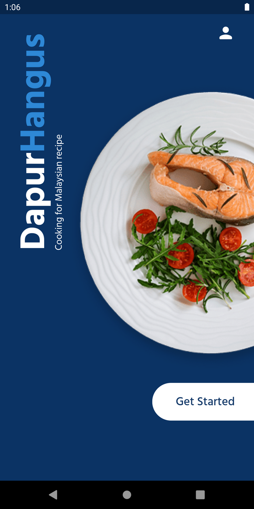
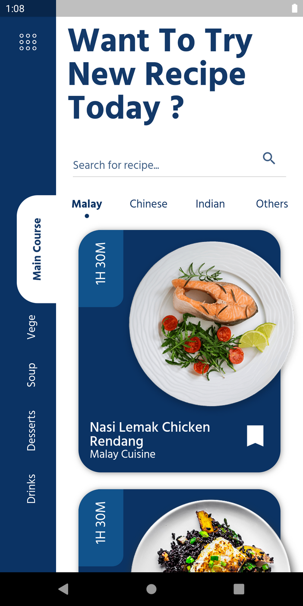
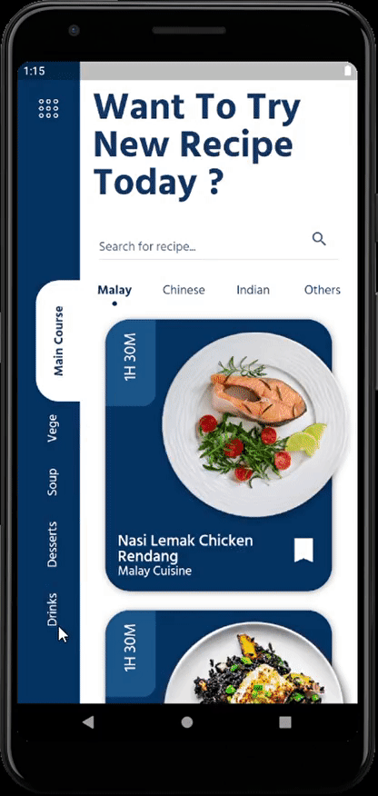
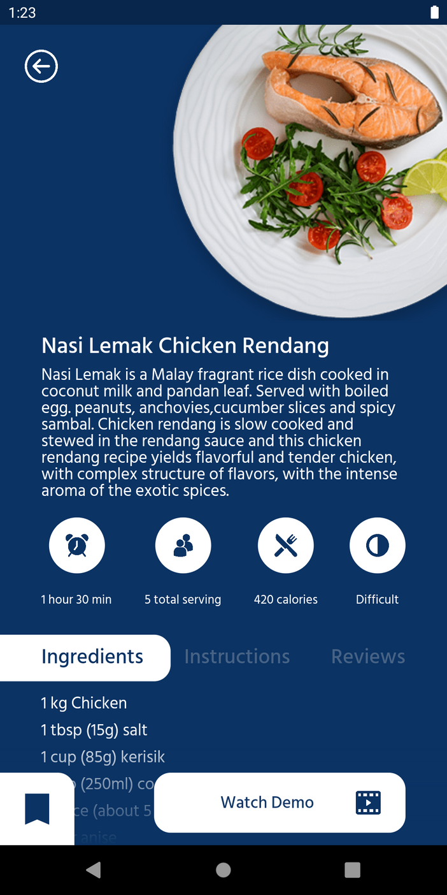

# dapur_hangus_app

This is demo flutter project for practice in UI implementation and skills development.

## About

This project implement the design found on [Behance](https://www.behance.net/gallery/100776963/Dapur-Hangus-UI-App).
I only used [Flutter SDK](https://flutter.dev/) for this.

For implementing side navigation bar I created my own custom template scaffold with custom navigation bar on the left side and expanding body on the right side.
On detailed recipe screen I also had to implement custom tabs and indicator for TabBar widget.

## How it looks

### Start screen

### Main screen

### Recipe screen

## Resources 

- Icons - [flaticon](https://www.flaticon.com/)
- Font - [Google Fonts](https://fonts.google.com/)
- images - [pngkey](https://www.pngkey.com/)
